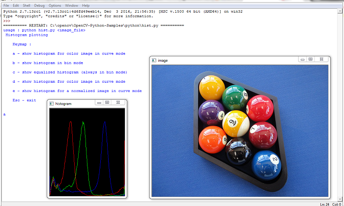
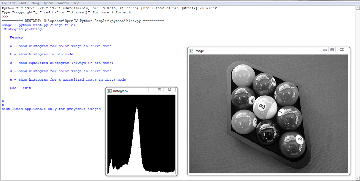
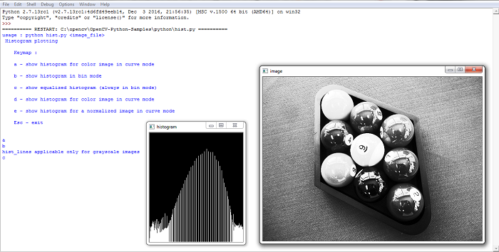
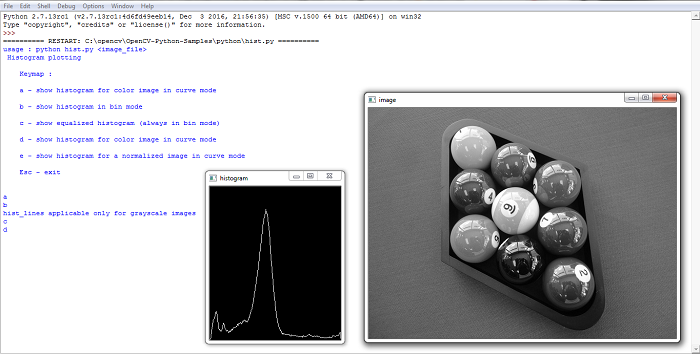
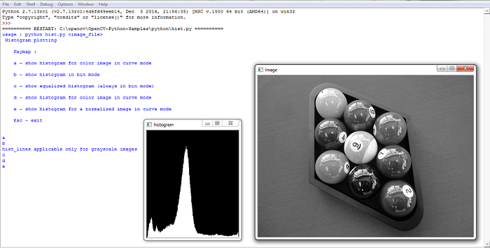

# Image Processing


* [Changing Color-spaces](#Changing-Color-spaces)
* [Object-Tracking](#Object-Tracking)
* [Image-Thresholding](#Image-Thresholding)
* [Smoothing-Images](#Smoothing-Images)
* [Smoothing-Images](#Smoothing-Images)
* [Image-Blurring](#Image-Blurring)
* [Morphological-Transformations](#Morphological-Transformations)
* [Image-Gradients](#Image-Gradients)
* [Canny-Edge-Detection](#Canny-Edge-Detection)
* [Image-Blending-using-Pyramids](#Image-Blending-using-Pyramids)
* [Contours](#Contours)
* [Histograms](#Histograms)
* [Matching-Shapes](#Matching-Shapes)
* [Template-Matching](#Template-Matching)
* [Hough-Transforms](#Hough-Transforms)
* [Image-Segmentation](#Image-Segmentation)
* [Foreground-Extraction](#Foreground-Extraction)

<hr>

___
## Changing Color-spaces
In OpenCV, the color-coding format is BGR ie Blue-Green-Red instead of the original RGB like in case of display in computers. Here we will see how to convert images from BGR format to grayscale or BGR to HSV (Hue-Saturation-Value)and vice-versa. For BGR→Gray conversion we use the flags `cv2.COLOR_BGR2GRAY`. Similarly for BGR→HSV, we use the flag `cv2.COLOR_BGR2HSV`.


```python
import cv2
flags = [i for i in dir(cv2) if i.startswith('COLOR_')]
print flags[:5] 
# I printed only the first 5 flags just for example purposes
# If you want to check all of them just use:
# print flags
```

    ['COLOR_BAYER_BG2BGR', 'COLOR_BAYER_BG2BGR_EA', 'COLOR_BAYER_BG2BGR_VNG', 'COLOR_BAYER_BG2GRAY', 'COLOR_BAYER_BG2RGB']
    

___
## Object Tracking
Now we know how to convert BGR image to HSV, we can use this to extract a colored object. In HSV, it is more easier
to represent a color than RGB color-space. In our application, we will try to extract a blue colored object. So here is
the method:
1. Take each frame of the video
2. Convert from BGR to HSV color-space
3. We threshold the HSV image for a range of blue color
4. Now extract the blue object alone, we can do whatever on that image we want.


```python
import cv2
import numpy as np
cap = cv2.VideoCapture(0)
while(1):
    # 1. Take each frame
    ret, frame = cap.read()
    
    # 2. Convert BGR to HSV
    hsv = cv2.cvtColor(frame, cv2.COLOR_BGR2HSV)
    
    # define range of blue color in HSV
    lower_blue = np.array([110,50,50])
    upper_blue = np.array([130,255,255])
    
    # Threshold the HSV image to get only blue colors
    mask = cv2.inRange(hsv, lower_blue, upper_blue)
    
    # Bitwise-AND mask and original image
    res = cv2.bitwise_and(frame,frame, mask= mask)
    cv2.imshow('frame',frame)
    cv2.imshow('mask',mask)
    cv2.imshow('res',res)
    k = cv2.waitKey(5) & 0xFF
    if k == 27:
        break
cv2.destroyAllWindows()
```

The resulting output would be something as follows:

**The Original Webcam Capture:**

**The Mask image:**

**The final result image:**


#### How to find HSV values to track?
This question arises everytime you'll perform object tracking. What you can do is use the same function,
_cv2.cvtColor()_ and instead of passing an image, you just pass the BGR values you want. For example, to find the
HSV value of Blue:


```python
import cv2
import numpy as np
blue = np.uint8([[[255,0,0 ]]])
hsv_blue = cv2.cvtColor(blue,cv2.COLOR_BGR2HSV)
print hsv_blue
```

    [[[120 255 255]]]
    

Now you take [H-10, 100,100] and [H+10, 255, 255] as lower bound and upper bound respectively. Apart from this
method, you can use any image editing tools like GIMP or any online converters to find these values, but then again you have
to adjust the HSV ranges.
___

## Image Thresholding
___


```python
import cv2
import numpy as np

#img = cv2.imread('images/th.png')
img = cv2.imread('images/th4.png')
# grayscale
grayscaled = cv2.cvtColor(img,cv2.COLOR_BGR2GRAY)

# simple threshold
#If pixel value is greater than a threshold value, it is assigned one value (may be white 255),
# else it is assigned another value (may be black 0)
retval, threshold = cv2.threshold(img, 12, 255, cv2.THRESH_BINARY)
"""
The first parameter here is the image.
The next parameter is the threshold, we are choosing 12.
(We are choosing 12, because this is a low-light picture, If everything is very bright it can be 220 or so)
The next is the maximum value, which we're choosing as 255.
Next and finally we have the type of threshold, which we've chosen as THRESH_BINARY.
Normally, a threshold of 10 would be somewhat poor of a choice.
"""

# threshold with grayscale
retval, threshold2 = cv2.threshold(grayscaled, 12, 255, cv2.THRESH_BINARY)

"""
Above we used a global value as threshold value.
But it may not be good in all the conditions where image has different lighting conditions in different areas.
In that case, we go for adaptive thresholding.
In this, the algorithm calculates the threshold for a small regions of the image.
So we get different thresholds for different regions of the same image
and it gives us better results for images with varying illumination
"""

# adaptive mean threshold
# threshold value is the mean of neighbourhood area.
amt = cv2.adaptiveThreshold(grayscaled,255,cv2.ADAPTIVE_THRESH_MEAN_C,cv2.THRESH_BINARY,11,2)

# guassian adaptive threshold
# threshold value is the weighted sum of neighbourhood values where weights are a gaussian window
gat = cv2.adaptiveThreshold(grayscaled, 255, cv2.ADAPTIVE_THRESH_GAUSSIAN_C, cv2.THRESH_BINARY, 115, 1)

# otsu threshold
retval2,otsuth = cv2.threshold(grayscaled,125,255,cv2.THRESH_BINARY+cv2.THRESH_OTSU)

cv2.imshow('Original Image',img)
cv2.imshow('Simple Thresholding',threshold)
cv2.imshow('Thresholding with Grayscale',threshold2)
cv2.imshow('Adaptive Mean Thresholding',amt)
cv2.imshow('Adaptive Gaussian Thresholding',gat)
cv2.imshow('Otsu thresholding',otsuth)
cv2.waitKey(0)
cv2.destroyAllWindows()

```

The output would look like: 
    

The original image was bright on one part, and dark on the other. Due to variations in lighting conditions we have such varied results of thresholding. Feel free to try different images with different lighting surroundings and analyze the results.
Most of the times one of these methods of thresholding would give you appropriate expected results as in this case Adaptive Mean Thresholding did the job for us.
___

## Smoothing Images

As in one-dimensional signals, images also can be filtered with various low-pass filters(LPF), high-pass filters(HPF) etc. LPF helps in removing noises, blurring the images etc. HPF filters helps in finding edges in the images.
OpenCV provides a function <a href="http://docs.opencv.org/3.0.0/d4/d86/group__imgproc__filter.html#ga27c049795ce870216ddfb366086b5a04">cv2.filter2D()</a> to convolve a kernel with an image.


```python
import cv2
import numpy as np
from matplotlib import pyplot as plt
img = cv2.imread('images/opencv_logo.png')
kernel = np.ones((5,5),np.float32)/25
dst = cv2.filter2D(img,-1,kernel)
plt.subplot(121),plt.imshow(img),plt.title('Original')
plt.xticks([]), plt.yticks([])
plt.subplot(122),plt.imshow(dst),plt.title('Averaging')
plt.xticks([]), plt.yticks([])
plt.show()
```


## Image Blurring
Image blurring is achieved by convolving the image with a low-pass filter kernel. It is useful for removing noise. It
actually removes high frequency content (e.g: noise, edges) from the image resulting in edges being blurred when this
is filter is applied.

The following code captures video using webcam and applies the following types of blurring techniques:
* Gaussian Blurring
* Median Blurring
* Bilateral Blurring


```python
import cv2
import numpy as np

cap = cv2.VideoCapture(0)

while(1):
    _, frame = cap.read()
    hsv = cv2.cvtColor(frame, cv2.COLOR_BGR2HSV)
    
    lower_red = np.array([30,150,50])
    upper_red = np.array([255,255,180])
    
    mask = cv2.inRange(hsv, lower_red, upper_red)
    res = cv2.bitwise_and(frame,frame, mask= mask)

    # Blurring
    
    # Gaussian Blurring
    blur = cv2.GaussianBlur(res,(15,15),0)
    cv2.imshow('Gaussian Blurring',blur)

    # Median Blurring
    median = cv2.medianBlur(res,15)
    cv2.imshow('Median Blur',median)

    # Bilateral Blurring
    bilateral = cv2.bilateralFilter(res,15,75,75)
    cv2.imshow('bilateral Blur',bilateral)

    #cv2.imshow('frame',frame)
    #cv2.imshow('mask',mask)
    #cv2.imshow('res',res)
    
    k = cv2.waitKey(5) & 0xFF
    if k == 27:
        break

cv2.destroyAllWindows()
cap.release()

```

___

## Morphological Transformations
Morphological transformations are simple operations based on the image shape. It is usually performed on
binary images. It needs two inputs, one is our original image, second one is called structuring element or kernel
which decides the nature of operation. Two basic morphological operators are Erosion and Dilation. Then its variant
forms like Opening, Closing, Gradient etc also comes into play.

You can find detailed explanations about these operations at: 
<a href="http://homepages.inf.ed.ac.uk/rbf/HIPR2/morops.htm">Morphological Operations at HIPR2</a>

The following code captures video using webcam and applies the above listed morphological operations on it:


```python
import cv2
import numpy as np

cap = cv2.VideoCapture(0)

while(1):

    _, frame = cap.read()
    hsv = cv2.cvtColor(frame, cv2.COLOR_BGR2HSV)
    
    lower_red = np.array([30,150,50])
    upper_red = np.array([255,255,180])
    
    mask = cv2.inRange(hsv, lower_red, upper_red)
    res = cv2.bitwise_and(frame,frame, mask= mask)

    # Morphological Traansformation
    kernel = np.ones((5,5),np.uint8)
    erosion = cv2.erode(mask,kernel,iterations = 1)
    dilation = cv2.dilate(mask,kernel,iterations = 1)
    opening = cv2.morphologyEx(mask, cv2.MORPH_OPEN, kernel)  # remove background noise 
    closing = cv2.morphologyEx(mask, cv2.MORPH_CLOSE, kernel)  # remove black pixels within the object

    cv2.imshow('Original',frame)
    cv2.imshow('Mask',mask)

    cv2.imshow('Erosion',erosion)
    cv2.imshow('Dilation',dilation)

    cv2.imshow('Opening',opening)
    cv2.imshow('Closing',closing)


    k = cv2.waitKey(5) & 0xFF
    if k == 27:
        break

cv2.destroyAllWindows()
cap.release()

```

___

## Image Gradients
OpenCV provides three types of gradient filters or High-pass filters, Sobel, Scharr and Laplacian.

Sobel operators is a joint Gausssian smoothing plus differentiation operation, so it is more resistant to noise. You
can specify the direction of derivatives to be taken, vertical or horizontal (by the arguments, yorder and xorder
respectively). You can also specify the size of kernel by the argument ksize. If ksize = -1, a 3x3 Scharr filter is used
which gives better results than 3x3 Sobel filter. Laplacian Derivatives calculates the Laplacian of the image.

Below code shows all operators in a single diagram. All kernels are of 5x5 size. Depth of output image is passed -1 to
get the result in np.uint8 type:


```python
import cv2
import numpy as np
from matplotlib import pyplot as plt
img = cv2.imread('dave.jpg',0)
laplacian = cv2.Laplacian(img,cv2.CV_64F)
sobelx = cv2.Sobel(img,cv2.CV_64F,1,0,ksize=5)
sobely = cv2.Sobel(img,cv2.CV_64F,0,1,ksize=5)

plt.subplot(2,2,1),plt.imshow(img,cmap = 'gray')
plt.title('Original'), plt.xticks([]), plt.yticks([])
plt.subplot(2,2,2),plt.imshow(laplacian,cmap = 'gray')
plt.title('Laplacian'), plt.xticks([]), plt.yticks([])
plt.subplot(2,2,3),plt.imshow(sobelx,cmap = 'gray')
plt.title('Sobel X'), plt.xticks([]), plt.yticks([])
plt.subplot(2,2,4),plt.imshow(sobely,cmap = 'gray')
plt.title('Sobel Y'), plt.xticks([]), plt.yticks([])
plt.show()
```


In our last example, output datatype is cv2.CV_8U or np.uint8. But there is a slight problem with that. Black-to-White
transition is taken as Positive slope (it has a positive value) while White-to-Black transition is taken as a Negative slope
(It has negative value). So when you convert data to np.uint8, all negative slopes are made zero. In simple words, you
miss that edge.

If you want to detect both edges, better option is to keep the output datatype to some higher forms, like cv2.CV_16S,
cv2.CV_64F etc, take its absolute value and then convert back to cv2.CV_8U. Below code demonstrates this procedure
for a horizontal Sobel filter and difference in results.


```python
import cv2
import numpy as np
from matplotlib import pyplot as plt
img = cv2.imread('box.png',0)

# Output dtype = cv2.CV_8U
sobelx8u = cv2.Sobel(img,cv2.CV_8U,1,0,ksize=5)

# Output dtype = cv2.CV_64F. Then take its absolute and convert to cv2.CV_8U
sobelx64f = cv2.Sobel(img,cv2.CV_64F,1,0,ksize=5)
abs_sobel64f = np.absolute(sobelx64f)
sobel_8u = np.uint8(abs_sobel64f)

plt.subplot(1,3,1),plt.imshow(img,cmap = 'gray')
plt.title('Original'), plt.xticks([]), plt.yticks([])
plt.subplot(1,3,2),plt.imshow(sobelx8u,cmap = 'gray')
plt.title('Sobel CV_8U'), plt.xticks([]), plt.yticks([])
plt.subplot(1,3,3),plt.imshow(sobel_8u,cmap = 'gray')
plt.title('Sobel abs(CV_64F)'), plt.xticks([]), plt.yticks([])
plt.show()
```

The result would be look like:


___

# Canny Edge Detection

Canny Edge Detection is one of the most commonly used techniques to find edges in images. In OpenCV _cv2.Canny()_ is used to carry out Canny Edge Detection. First argument to be passed in this function is our input
image. Second and third arguments are our minVal and maxVal respectively. Third argument is aperture_size. It is the
size of Sobel kernel used for find image gradients. By default it is 3. Last argument is L2gradient which specifies the
equation for finding gradient magnitude.


```python
import cv2
import numpy as np
from matplotlib import pyplot as plt
img = cv2.imread('images/cube.png',0)
edges = cv2.Canny(img,100,200)
plt.subplot(121),plt.imshow(img,cmap = 'gray')
plt.title('Original Image'), plt.xticks([]), plt.yticks([])
plt.subplot(122),plt.imshow(edges,cmap = 'gray')
plt.title('Edge Image'), plt.xticks([]), plt.yticks([])
plt.show()
```

The resulting output would look like:
    

___


## Image Blending using Pyramids
___
Normally, we used to work with an image of constant size. But in some occassions, we need to work with images of different resolution of the same image. For example, while searching for something in an image, like face, we are not sure at what size the object will be present in the image. In that case, we will need to create a set of images with different resolution and search for object in all the images. These set of images with different resolution are called Image Pyramids (because when they are kept in a stack with biggest image at bottom and smallest image at top look like a pyramid). Basically an “image pyramid” is a multi-scale representation of an image.

There are two kinds of Image Pyramids. 1) Gaussian Pyramid and 2) Laplacian Pyramids
We can find Gaussian pyramids using <a href="http://docs.opencv.org/3.0.0/d4/d86/group__imgproc__filter.html#gaf9bba239dfca11654cb7f50f889fc2ff">cv2.pyrDown()</a> and <a href="http://docs.opencv.org/3.0.0/d4/d86/group__imgproc__filter.html#gada75b59bdaaca411ed6fee10085eb784">cv2.pyrUp()</a> functions.
Laplacian Pyramids are formed from the Gaussian Pyramids. There is no exclusive function for that. Laplacian
pyramid images are like edge images only. Most of its elements are zeros. They are used in image compression. A
level in Laplacian Pyramid is formed by the difference between that level in Gaussian Pyramid and expanded version
of its upper level in Gaussian Pyramid.


```python
img = cv2.imread('images/googlelogo.jpg')
lower_reso = cv2.pyrDown(higher_reso)
```


```python
# Now you can go down the image pyramid with cv2.pyrUp() function.
higher_reso2 = cv2.pyrUp(lower_reso)
```

The following code results in forming the image pyramid of a 500x500 image of Google Logo. First we import the imutils package which contains a handful of image processing convenience functions that are commonly used such as resizing, rotating, translating, etc


```python
# import the necessary packages
import imutils

def pyramid(image, scale=1.5, minSize=(30, 30)):
    # yield the original image
    yield image

    # keep looping over the pyramid
    while True:
        # compute the new dimensions of the image and resize it
        w = int(image.shape[1] / scale)
        image = imutils.resize(image, width=w)

        if image.shape[0] < minSize[1] or image.shape[1] < minSize[0]:
            break

        # yield the next image in the pyramid
        yield image
```

This pyramid function takes two arguments.
1. Scale : By how much the image is resized at each layer.
2. minSize :The minimum required width and height of the layer. If an image in the pyramid falls below this minSize , we stop constructing the image pyramid.

Initially we yield the original image. Then we loop over to form our image pyramid.

Over each iteration, scaling of the image in the next layer of the pyramid (while preserving the aspect ratio) is performed. This scale is controlled by the scale factor.

Until our image meets the minSize  requirements, we loop. Then finally we have different sized versions of our image.


```python
import argparse
import cv2


# load the 500 x 500 image of Google Logo
image = cv2.imread("images/googlelogo.jpg")

# loop over the image pyramid
for (i, resized) in enumerate(pyramid(image, scale=2)):
    # show the resized image
    cv2.imshow("Layer {}".format(i + 1), resized)
    # saving all the resized images
    cv2.imwrite("ImagePyramid/Layer {}.jpg".format(i + 1),resized)
    cv2.waitKey(0)

# close all windows
cv2.destroyAllWindows()
```

The resulting resized images would be saved in a folder named ImagePyramid in your project directory.
It would look something like:

    
If all the images are compared in terms of size, it would look like:


In this code, I used scale = 2. Hence each next image was half the size of its previous image.
Feel free to use different scales and compare the results.
___

One application of Pyramids is Image Blending. For example, in image stitching, you will need to stack two images together, but it may not look good due to discontinuities between images. In that case, image blending with Pyramids gives you seamless blending without leaving much data in the images. 

Given below is an example of how to make one of the most iconic pictures in comic book history- **Batman and Joker** with the technique of Image Blending.

You can find elaborate explanations with diagrams at <a href="http://pages.cs.wisc.edu/~csverma/CS766_09/ImageMosaic/imagemosaic.html">Image Blending</a>.

Following are the steps to be performed:
1. Load the two images of Batman and Joker
2. Find the Gaussian Pyramids for Batman and Joker (in this particular example, number of layers is 6)
3. From Gaussian Pyramids, find their Laplacian Pyramids
4. Now join the left half of Batman's face and right half of Joker's ever similing face in each layers of Laplacian Pyramids
5. Finally from this joint image pyramids, reconstruct the original image.

Below is the full code. (For sake of simplicity, each step is done separately which may take more memory. You can
optimize it if you want so).
We would be using these two images of size 700 x 315 as input (However you can use any two images if you want.):


 


```python
import cv2
import numpy as np,sys

A = cv2.imread('captures/batman1.png')
B = cv2.imread('captures/joker2.png')

# generate Gaussian pyramid for A
G = A.copy()
gpA = [G]
for i in xrange(6):
    G = cv2.pyrDown(gpA[i])
    gpA.append(G)

# generate Gaussian pyramid for B
G = B.copy()
gpB = [G]
for i in xrange(6):
    G = cv2.pyrDown(gpB[i])
    gpB.append(G)

# generate Laplacian Pyramid for A
lpA = [gpA[5]]
for i in xrange(5,0,-1):
    size = (gpA[i-1].shape[1], gpA[i-1].shape[0])
    GE = cv2.pyrUp(gpA[i], dstsize = size)
    L = cv2.subtract(gpA[i-1],GE)
    lpA.append(L)

# generate Laplacian Pyramid for B
lpB = [gpB[5]]
for i in xrange(5,0,-1):
    size = (gpB[i-1].shape[1], gpB[i-1].shape[0])
    GE = cv2.pyrUp(gpB[i], dstsize = size)
    L = cv2.subtract(gpB[i-1],GE)
    lpB.append(L)
    
# Now add left and right halves of images in each level
LS = []
for la,lb in zip(lpA,lpB):
    rows,cols,dpt = la.shape
    ls = np.hstack((la[:,0:cols/2], lb[:,cols/2:]))
    LS.append(ls)
    
# now reconstruct
ls_ = LS[0]
for i in xrange(1,6):
    size = (LS[i].shape[1], LS[i].shape[0])
    ls_ = cv2.pyrUp(ls_, dstsize = size)
    ls_ = cv2.add(ls_, LS[i])

    
# image with direct connecting each half
real = np.hstack((A[:,:cols/2],B[:,cols/2:]))
cv2.imwrite('Pyramid blending.jpg',ls_)
cv2.imwrite('Direct blending.jpg',real)

```

The resulting images after blending would look like: 
    
    Direct Blending :
    

    
    and Pyramid Blending : 
        


___
_**Pretty cool isn't it! :D**_
___

## Contours
Contours is simply a curve joining all the continuous points along the boundary, having same color or intensity. The contours can be useful for shape analysis and object detection and recognition.

To find contours with a better accuracy, binary images are used. So most of the times before finding contours, threshold or canny edge detection is applied.
_findContours()_ function modifies the source image. So you have to save the image in some temporary variable before applying it, if you want source image.

In OpenCV, finding contours is like finding white object from black background. Here's how it can be done:


```python
import numpy as np
import cv2
im = cv2.imread('images/testimage.jpg')
imgray = cv2.cvtColor(im,cv2.COLOR_BGR2GRAY)
ret,thresh = cv2.threshold(imgray,127,255,0)
image, contours, hierarchy = cv2.findContours(thresh,cv2.RETR_TREE,cv2.CHAIN_APPROX_SIMPLE)
```

There are three arguments in cv2.findContours() function
1. Source image
2. Contour retrieval mode,
3. Contour approximation method.

If you pass cv2.CHAIN_APPROX_NONE as the third argument, all the boundary points are stored i.e. if we found contour of a straight line, we'll get all the points on the line.

Whereas if we need just the two end points of the line, then cv2.CHAIN_APPROX_SIMPLE should be passed. It removes all redundant points and compresses the contour, thereby saving memory.

Below image of a rectangle demonstrate this technique. Just draw a circle on all the coordinates in the contour array (drawn in blue color). First image shows points I got with cv2.CHAIN_APPROX_NONE (734 points) and second image shows the one with cv2.CHAIN_APPROX_SIMPLE (only 4 points). See, how much memory it saves!


The output of this function is the contours and hierarchy. _contours_ is a Python list of all the contours in the image. Each individual contour is a Numpy array of (x,y) coordinates of boundary points of the object.

### Drawing the contours:
To draw the contours, _cv2.drawContours()_ function is used. It can also be used to draw any shape provided you
have its boundary points. Its arguments are
1. Source image
2. Contours which should be passed as a Python list
3. Index of contours (useful when drawing individual contour. To draw all contours, pass -1)
4. Color, Thickness etc.

To draw all the contours in an image:


```python
img = cv2.drawContours(img, contours, -1, (0,255,0), 3)
```

To draw an individual contour, say 4th contour:


```python
img = cv2.drawContours(img, contours, 3, (0,255,0), 3)
```

Another more useful method is :


```python
cnt = contours[4]
cv2.drawContours(img, [cnt], 0, (0,255,0), 3)
```

## Finding the Contour Features:

### Image Moments
<a href="http://en.wikipedia.org/wiki/Image_moment">Image moments</a> can help you to calculate some features like center of mass of the object, area of the object etc
The function cv2.moments() gives a dictionary of all moment values calculated. See below:


```python
import cv2
import numpy as np
# I am using a basic star image
img = cv2.imread('images/star.png',0)
ret,thresh = cv2.threshold(img,127,255,0)
_,contours,hierarchy, = cv2.findContours(thresh, 1, 2)
cnt = contours[0]
M = cv2.moments(cnt)
print M
```

    {'mu02': 4293924291.143133, 'mu03': 63142297875.93164, 'm11': 10223790320.25, 'nu02': 0.1488429929630718, 'm12': 3525902955684.9165, 'mu21': 21803315369.182495, 'mu20': 4410354955.029182, 'nu20': 0.15287890214787567, 'm30': 5991419770513.0, 'nu21': 0.0018338552415319222, 'mu11': 4699166.697471619, 'mu12': -3947014808.411865, 'nu11': 0.00016289016486079318, 'nu12': -0.00033197950276135505, 'm02': 14056865696.0, 'm03': 5492215401421.25, 'm00': 169849.0, 'm01': 40721319.166666664, 'mu30': -13260752252.398438, 'nu30': -0.0011153487262349736, 'nu03': 0.005310836079810775, 'm10': 42623924.0, 'm20': 15106908347.5, 'm21': 3646045025879.5835}
    


```python
# From this moments, you can extract useful data like:
# Centroid
cx = int(M['m10']/M['m00'])
cy = int(M['m01']/M['m00'])
print "Cx =",cx," Cy =",cy

# Contour Area
# Contour area is given by the function cv2.contourArea() or from moments, M[’m00’].
area = cv2.contourArea(cnt)
print "Contour Area: ", area

# Contour Perimeter
# It is also called arc length. It can be found out using cv2.arcLength() function.
# Second argument specify whether shape is a closed contour (if passed True), or just a curve.
perimeter = cv2.arcLength(cnt,True)
print "Contour Perimeter: ", perimeter
```

### Contour Approximation
It approximates a contour shape to another shape with less number of vertices depending upon the precision we specify.
It is an implementation of <a href="http://en.wikipedia.org/wiki/Ramer-Douglas-Peucker_algorithm">Douglas-Peucker algorithm</a>.
To understand this, suppose you are trying to find a square in an image, but due to some problems in the image, you
didn’t get a perfect square, but a “bad shape” (As shown in first image below). Now you can use this function to
approximate the shape. In this, second argument is called epsilon, which is maximum distance from contour to
approximated contour. It is an accuracy parameter. A wise selection of epsilon is needed to get the correct output.


```python
epsilon = 0.1*cv2.arcLength(cnt,True)
approx = cv2.approxPolyDP(cnt,epsilon,True)
```

Below, in second image, green line shows the approximated curve for epsilon = 10% of arc length. Third
image shows the same for epsilon = 1% of the arc length. Third argument specifies whether curve is
closed or not


### Checking Convexity
_cv2.isContourConvex()_ is used to check if a curve is convex or not. It just return whether True or False.


```python
k = cv2.isContourConvex(cnt)
print k 
```

    False
    

Thus stating the obvious that a star (the image I have taken) is not convex.

### Bounding Rectangle
There are two types of bounding rectangles.

**1. Straight Bounding Rectangle:**

It is a straight rectangle, it doesn’t consider the rotation of the object. So area of
the bounding rectangle won’t be minimum. It is found by the function cv2.boundingRect().
Let (x,y) be the top-left coordinate of the rectangle and (w,h) be its width and height.


```python
x,y,w,h = cv2.boundingRect(cnt)
img = cv2.rectangle(img,(x,y),(x+w,y+h),(0,255,0),2)
```

**2. Rotated Rectangle:**

Here, bounding rectangle is drawn with minimum area, so it considers the rotation also.
The function used is cv2.minAreaRect(). It returns a Box2D structure which contains following detals - ( top-left
corner(x,y), (width, height), angle of rotation ). But to draw this rectangle, we need 4 corners of the rectangle. It is
obtained by the function cv2.boxPoints()


```python
rect = cv2.minAreaRect(cnt)
box = cv2.boxPoints(rect)
box = np.int0(box)
im = cv2.drawContours(im,[box],0,(0,0,255),2)
```

Both the rectangles are shown in a single image. Green rectangle shows the normal bounding rect. Red rectangle is
the rotated rect.


### Minimum Enclosing Circle
Next we find the circumcircle of an object using the function cv2.minEnclosingCircle(). It is a circle which completely
covers the object with minimum area.


```python
(x,y),radius = cv2.minEnclosingCircle(cnt)
center = (int(x),int(y))
radius = int(radius)
img = cv2.circle(img,center,radius,(0,255,0),2)
```


### Fitting an Ellipse
Next one is to fit an ellipse to an object. It returns the rotated rectangle in which the ellipse is inscribed.


```python
ellipse = cv2.fitEllipse(cnt)
cv2.ellipse(img,ellipse,(0,255,0),2)
```


### Fitting a Line
Similarly we can fit a line to a set of points. Below image contains a set of white points. We can approximate a straight
line to it.


```python
rows,cols = img.shape[:2]
[vx,vy,x,y] = cv2.fitLine(cnt, cv2.DIST_L2,0,0.01,0.01)
lefty = int((-x*vy/vx) + y)
righty = int(((cols-x)*vy/vx)+y)
img = cv2.line(img,(cols-1,righty),(0,lefty),(0,255,0),2)
```


___
## Histograms

This is a sample for histogram plotting for RGB images and grayscale images for better understanding of colour distribution.

Using this we can learn how to draw histogram of images and also get familier with cv2.calcHist, cv2.equalizeHist,cv2.normalize and some drawing functions

We use the following functions :
1) hist_curve : returns histogram of an image drawn as curves
2) hist_lines : return histogram of an image drawn as bins ( only for grayscale images )

#### Usage :
```python hist.py <image_file>```

Credits : Abid Rahman 3/14/12 debug Gary Bradski

### hist.py


```python
#!/usr/bin/env python
# Python 2/3 compatibility
from __future__ import print_function

import cv2
import numpy as np

bins = np.arange(256).reshape(256,1)

def hist_curve(im):
    h = np.zeros((300,256,3))
    if len(im.shape) == 2:
        color = [(255,255,255)]
    elif im.shape[2] == 3:
        color = [ (255,0,0),(0,255,0),(0,0,255) ]
    for ch, col in enumerate(color):
        hist_item = cv2.calcHist([im],[ch],None,[256],[0,256])
        cv2.normalize(hist_item,hist_item,0,255,cv2.NORM_MINMAX)
        hist=np.int32(np.around(hist_item))
        pts = np.int32(np.column_stack((bins,hist)))
        cv2.polylines(h,[pts],False,col)
    y=np.flipud(h)
    return y

def hist_lines(im):
    h = np.zeros((300,256,3))
    if len(im.shape)!=2:
        print("hist_lines applicable only for grayscale images")
        #print("so converting image to grayscale for representation"
        im = cv2.cvtColor(im,cv2.COLOR_BGR2GRAY)
    hist_item = cv2.calcHist([im],[0],None,[256],[0,256])
    cv2.normalize(hist_item,hist_item,0,255,cv2.NORM_MINMAX)
    hist=np.int32(np.around(hist_item))
    for x,y in enumerate(hist):
        cv2.line(h,(x,0),(x,y),(255,255,255))
    y = np.flipud(h)
    return y


if __name__ == '__main__':

    import sys

    if len(sys.argv)>1:
        fname = sys.argv[1]
    else :
        fname = 'images/9ball.jpg'
        print("usage : python hist.py <image_file>")

    im = cv2.imread(fname)

    if im is None:
        print('Failed to load image file:', fname)
        sys.exit(1)

    gray = cv2.cvtColor(im,cv2.COLOR_BGR2GRAY)


    print(''' Histogram plotting \n
    Keymap :\n
    a - show histogram for color image in curve mode \n
    b - show histogram in bin mode \n
    c - show equalized histogram (always in bin mode) \n
    d - show histogram for color image in curve mode \n
    e - show histogram for a normalized image in curve mode \n
    Esc - exit \n
    ''')

    cv2.imshow('image',im)
    while True:
        k = cv2.waitKey(0)&0xFF
        if k == ord('a'):
            curve = hist_curve(im)
            cv2.imshow('histogram',curve)
            cv2.imshow('image',im)
            print('a')
        elif k == ord('b'):
            print('b')
            lines = hist_lines(im)
            cv2.imshow('histogram',lines)
            cv2.imshow('image',gray)
        elif k == ord('c'):
            print('c')
            equ = cv2.equalizeHist(gray)
            lines = hist_lines(equ)
            cv2.imshow('histogram',lines)
            cv2.imshow('image',equ)
        elif k == ord('d'):
            print('d')
            curve = hist_curve(gray)
            cv2.imshow('histogram',curve)
            cv2.imshow('image',gray)
        elif k == ord('e'):
            print('e')
            norm = cv2.normalize(gray, gray, alpha = 0,beta = 255,norm_type = cv2.NORM_MINMAX)
            lines = hist_lines(norm)
            cv2.imshow('histogram',lines)
            cv2.imshow('image',norm)
        elif k == 27:
            print('ESC')
            cv2.destroyAllWindows()
            break
    cv2.destroyAllWindows()

```

On running this script, we get the following output. You just have to click on the 'a','b','c','d' or 'e' key to get the different histograms. 

a - Histogram for color image in curve mode. 

<p></p>

b - Histogram in bin mode.

<p></p>

c - Equalized histogram (always in bin mode).

<p></p>

d - Histogram for color image in curve mode.

<p></p>

e - Histogram for a normalized image in curve mode.

<p></p>

___
## Matching Shapes

OpenCV comes with a function cv2.matchShapes() which enables us to compare two shapes, or
two contours and returns a metric showing the similarity. The lower the result, the better match it is. It is calculated
based on the hu-moment values.


```python
import cv2
import numpy as np
img1 = cv2.imread('images/star.png',0)
#img2 = cv2.imread('images/star.png',0)
#img2 = cv2.imread('images/diamond.png',0)
#img2 = cv2.imread('images/invertedstar.png',0)
#img2 = cv2.imread('images/rect.png',0)
#img2 = cv2.imread('images/triangle.png',0)
img2 = cv2.imread('images/star2.png',0)

ret, thresh = cv2.threshold(img1, 127, 255,0)
ret, thresh2 = cv2.threshold(img2, 127, 255,0)
_,contours,hierarchy = cv2.findContours(thresh,2,1)
cnt1 = contours[0]
_,contours,hierarchy = cv2.findContours(thresh2,2,1)
cnt2 = contours[0]
ret = cv2.matchShapes(cnt1,cnt2,1,0.0)
print ret
```

    0.466799997373
    

I tried matching a few shapes.


Here are the resulting outputs:


<table style="width:50%">
<tr>
<td>Star and Star</td><td>0.0</td>
</tr>
<tr>
<td>Star and Triangle</td><td>0.0915346946157</td>
</tr>
<tr>
<td>Star and Diamond</td><td>0.138958575287</td>
</tr>
<tr>
<td>Star and Inverted Star</td><td>0.0228166713275</td>
</tr>
<tr>
<td>Star and Rect</td><td>0.327394451118</td>
</tr>
</table>


This actually means, among the given shapes; Star and Star i.e itself match the most, then triangle, then diamond and ultimately it differs the most from a rectangle. Note here, while comparing two shapes, the color of these shapes might prove to be a factor while comparing. This means that a filled star would be quite different from a normal star. Check yourself to find out different results.
___

## Template Matching
___
_Template matching is a technique in digital image processing for finding small parts of an image which match a template image. It can be used in manufacturing as a part of quality control, a way to navigate a mobile robot, or as a way to detect edges in images._

Template Matching is a method for searching and finding the location of a template image in a larger image. OpenCV comes with a function <a href="http://docs.opencv.org/3.0.0/df/dfb/group__imgproc__object.html#ga586ebfb0a7fb604b35a23d85391329be">cv2.matchTemplate()</a> for this purpose. It simply slides the template image over the input image (as in 2D convolution) and compares the template and patch of input image under the template image. Several comparison methods are implemented in OpenCV. It returns a grayscale image, where each pixel denotes how much does the neighbourhood of that pixel match with template.


```python
import cv2
import numpy as np

img_rgb = cv2.imread('letters.jpg')
img_gray = cv2.cvtColor(img_rgb, cv2.COLOR_BGR2GRAY)

template = cv2.imread('K.jpg',0)
#template = cv2.imread('S.jpg',0)
w, h = template.shape[::-1]

"""
We keep the original RGB image, and create a grayscale version.
This is because we do all of the processing in the grayscale version,
then use the same coordinates for labels and such on the color image.

With the main image, we just have the color version and the grayscale version.
We load the template and note the dimensions.
"""

res = cv2.matchTemplate(img_gray,template,cv2.TM_CCOEFF_NORMED)
threshold = 0.8
loc = np.where( res >= threshold)

"""
We call res the matchTemplate between the img_gray (our main image),
the template, and then the matching method we're going to use.
We specify a threshold, here 0.8 for 80%.
Then we find locations with a logical statement, where the res is greater than or equal to 80%.

Finally, we mark all matches on the original image, using the coordinates we found in the gray image:
"""

for pt in zip(*loc[::-1]):
    cv2.rectangle(img_rgb, pt, (pt[0] + w, pt[1] + h), (0,255,255), 2)

cv2.imshow('Detected',img_rgb)

```

To test this example of template matching, I used the following image of alphabets as the testimage and the images of K and S as templates:


The resulting output with detected matches looked like:

 


You can use Template matching for multiple object detection too.
The same code can be applied for the following famous atari game and the results would look as follows:


Make sure you tweak the threshold according to your own purposes.
___

## Hough Transforms
<a href="http://en.wikipedia.org/wiki/Hough_transform">Hough Transform</a> is a popular technique to detect any shape, if you can represent that shape in mathematical form. It can detect the shape even if it is broken or distorted a little bit.

### 1] Detect Lines using Hough Transforms:
<a href="http://docs.opencv.org/3.0.0/dd/d1a/group__imgproc__feature.html#ga46b4e588934f6c8dfd509cc6e0e4545a">cv2.HoughLines()</a> is a function in OpenCV to detect lines in an image using hough transforms. The arguments passed in the function are explained: First parameter, Input image should be a binary image, so apply threshold or use canny edge detection before finding applying hough transform. Second and third parameters are ρ and θ accuracies respectively. Fourth argument is the threshold, which means minimum vote it should get for it to be considered as a line. Remember, number of votes depend upon number of points on the line. So it represents the minimum length of line that should be detected.


```python
import cv2
import numpy as np
import math

image1 = cv2.imread('images/chess.png')
#image1 = cv2.imread('images/building.jpg')
gray=cv2.cvtColor(image1,cv2.COLOR_BGR2GRAY)
edges = cv2.Canny(gray, 50, 200)

lines= cv2.HoughLines(edges, 1, math.pi/180.0, 185, np.array([]), 0, 0)

a,b,c = lines.shape
for i in range(a):
    rho = lines[i][0][0]
    theta = lines[i][0][1]
    a = math.cos(theta)
    b = math.sin(theta)
    x0, y0 = a*rho, b*rho
    pt1 = ( int(x0+1000*(-b)), int(y0+1000*(a)) )
    pt2 = ( int(x0-1000*(-b)), int(y0-1000*(a)) )
    cv2.line(image1, pt1, pt2, (0, 0, 255), 2, cv2.LINE_AA)

#cv2.imshow('image1',image1)
cv2.imwrite('Results/chessboard1.png',image1)
#cv2.imwrite('Results/building1.png',image1)

```


    True


I used two images to test this code: 
    
 


The resulting output images were :
    
 


___

### 2] Detect Circles using Hough Transforms:
<a href="http://docs.opencv.org/3.0.0/dd/d1a/group__imgproc__feature.html#ga47849c3be0d0406ad3ca45db65a25d2d"> cv2.HoughCircles()</a> would b used to detect circular patterns in an image. The following code will explain it's usage. If you want to go deeper into theoretical aspects, please click the links to see the docs, not for only cv2.HoughCircles() but also other links provided for the different mentioned functions before. 
We would be using the following image of coins which is extensively used by researchers to test and apply Computer Vision algos.


```python
import cv2
import numpy as np

img = cv2.imread('images/coins.png',0)
img = cv2.medianBlur(img,5)
cimg = cv2.cvtColor(img,cv2.COLOR_GRAY2BGR)
circles = cv2.HoughCircles(img,cv2.HOUGH_GRADIENT,1,20,
param1=50,param2=30,minRadius=0,maxRadius=0)

circles = np.uint16(np.around(circles))
for i in circles[0,:]:
    # draw the outer circle
    cv2.circle(cimg,(i[0],i[1]),i[2],(0,255,0),2)
    # draw the center of the circle
    cv2.circle(cimg,(i[0],i[1]),2,(0,0,255),3)
    
cv2.imshow('detected circles',cimg)
```

Here we used the image of coins which is extensively used by researchers to test and apply Computer Vision algos, as we would see further.
After applying houghCircles(), the resulting image had the circles in it detected.

 


___

## Image Segmentation
___

For Image Segmentation, OpenCV uses a marker-based watershed algorithm where we give different labels for our object we know.
Label the region which we are sure of being the foreground or object with one color (or intensity), label the region
which we are sure of being background or non-object with another color and finally the region which we are not sure
of anything, label it with 0. That is our marker. Then apply watershed algorithm. Then our marker will be updated
with the labels we gave, and the boundaries of objects will have a value of -1
We will use the Distance Transform along with watershed to segment mutually touching objects. We will use the same image of coins as above to understand the procedure of Image Segmentation


```python
import numpy as np
import cv2
from matplotlib import pyplot as plt
img = cv2.imread('images/coins.png')
gray = cv2.cvtColor(img,cv2.COLOR_BGR2GRAY)
# To get an estimation of the coins, we performed binarization using Otsu's Method.
ret, thresh = cv2.threshold(gray,0,255,cv2.THRESH_BINARY_INV+cv2.THRESH_OTSU)
```

The resulting image would look like:
    

To remove the small white noises in the image, we'll use morphological opening whereas to remove any small holes in the object, we can use morphological closing. At the moment we have confirmed that the region near to center of objects are foreground and region much away from the object are background. Now we have to define the boundary region of coins.

So we need to extract the area which we are sure they are coins. For that we could find the distance transform and apply a proper threshold. Next we need to find the area which we are sure they are not coins. For that, we dilate the result. Dilation increases object boundary to background. This way, we can make sure whatever region in background in result is really a background, since boundary region is removed. See the resulting image below.


Now Watershed algorithm would be used to confirm the remaining regions are still unconfirmed, whether it is coins or background.  These areas are normally around the border i.e. boundaries of coins where foreground and background meet (Or
even two different coins meet). It can be obtained from subtracting sure_fg area from sure_bg area.


```python
# noise removal
kernel = np.ones((3,3),np.uint8)
opening = cv2.morphologyEx(thresh,cv2.MORPH_OPEN,kernel, iterations = 2)
# sure background area
sure_bg = cv2.dilate(opening,kernel,iterations=3)
# Finding sure foreground area
dist_transform = cv2.distanceTransform(opening,cv2.DIST_L2,5)
ret, sure_fg = cv2.threshold(dist_transform,0.7*dist_transform.max(),255,0)
# Finding unknown region
sure_fg = np.uint8(sure_fg)
unknown = cv2.subtract(sure_bg,sure_fg)
```

See the image below. In the thresholded image, we get some regions of coins which we are sure of coins and they are detached
now. 
[All of this we are doing in image segmentation is seperating the foreground from the background and then seperating the indivdual segments in the foreground by there border. If all you want to do is foreground segmentation and not separate the mutually touching objects, you need not use distance transform, just erosion is sufficient. Erosion is just another method to
extract sure foreground area.)


As we can see we are confident to distinguish among the coins and the background. Hence we create a marker (i.e an array of same size as that of original image, but with int32 datatype) and label the regions inside it. The regions we know for sure (whether foreground or background) are labelled with any positive integers, but different integers, and the area we don't know for sure are just left as zero. For this we use <a href="http://docs.opencv.org/3.0.0/d3/dc0/group__imgproc__shape.html#gac2718a64ade63475425558aa669a943a">cv2.connectedComponents()</a>. It labels background of the image with 0, then other objects are labelled with integers starting from 1.

However if background is marked with 0, watershed will consider it as unknown area. So we want to mark it with different integer. Instead, we will mark unknown region, defined by unknown, with 0.


```python
# Marker labelling
ret, markers = cv2.connectedComponents(sure_fg)
# Add one to all labels so that sure background is not 0, but 1
markers = markers+1
# Now, mark the region of unknown with zero
markers[unknown==255] = 0
```

See the result shown in JET colormap. The dark blue region shows unknown region. Sure coins are colored with
different values. Remaining area which are sure background are shown in lighter blue compared to unknown region.


Now that our marker is ready, we would be finally applying watershed algorithm. Then marker image will be modified. The boundary
region will be marked with -1.


```python
markers = cv2.watershed(img,markers)
img[markers == -1] = [255,0,0]
```

See the result below. For some coins, the region where they touch are segmented properly and for some, they are not:


___

## Foreground Extraction
___
Here will see GrabCut algorithm to extract foreground in images. The way this algo works can be put in simple terms as it basically finds the foreground and removes the background.

From a user's point of view: Initially user draws a rectangle around the foreground region. Then algorithm segments it iteratively to get the best result. User is required to provide some touchups in case, the segmentation may have marked some foreground region as background and vice versa. User just gives some strokes on the images where some faulty results are there. Then in the next iteration, you get better results.

See the image below. First player and football is enclosed in a blue rectangle. Then some final touchups with white strokes (denoting foreground) and black strokes (denoting background) is made. And we get a nice result.


Below we will see the code to implement this.

We would be using the same Messi image as an example:


First we import the modules, load in our image, create a mask and specify the background and foreground model, which is used by the algorithm internally. Then the real important part is the rect we define. Arguments to be passed in rect are: rect = **(start_x, start_y, width, height)**. If you are using your own image, you have to define your own rectangle, and a simple way to do it would be to open the image in _Microsoft Paint_ or other image editors and just hover around to find the top left and then  the respective width and height of the rectangle.


```python
import numpy as np
import cv2
from matplotlib import pyplot as plt

img = cv2.imread('images/messi.png')
#Creating the mask
mask = np.zeros(img.shape[:2],np.uint8)

# Specifying the background and the foreground model.
bgdModel = np.zeros((1,65),np.float64)
fgdModel = np.zeros((1,65),np.float64)

# Drawing a rectangle around the foreground.
rect = (50,50,380,450)
```

Then we would be using cv2.grabCut(), which has the folloeing parameters. First the input image, then the mask, then the rectangle for our main object, the background model, foreground model, the amount of iterations to run, and what mode you are using.

From here, the mask is changed so that all 0 and 2 pixels are converted to the background, where the 1 and 3 pixels are now the foreground. Then we multiply with the input image to get our final result:


```python
cv2.grabCut(img,mask,rect,bgdModel,fgdModel,5,cv2.GC_INIT_WITH_RECT)
mask2 = np.where((mask==2)|(mask==0),0,1).astype('uint8')
img = img*mask2[:,:,np.newaxis]

plt.imshow(img)
plt.colorbar()
plt.show()
```

The foreground extraction of our image would look like:


Here is the full code to be implemented:


```python
import numpy as np
import cv2
from matplotlib import pyplot as plt

img = cv2.imread('messi.png')
mask = np.zeros(img.shape[:2],np.uint8)

bgdModel = np.zeros((1,65),np.float64)  # background model
fgdModel = np.zeros((1,65),np.float64)  # foreground model

rect = (50,50,380,450)

cv2.grabCut(img,mask,rect,bgdModel,fgdModel,5,cv2.GC_INIT_WITH_RECT)
"""
Parameters: First the input image, then the mask,
then the rectangle for our main object, the background model, foreground model,
the amount of iterations to run, and what mode you are using
"""

mask2 = np.where((mask==2)|(mask==0),0,1).astype('uint8')
img = img*mask2[:,:,np.newaxis]
"""
From here, the mask is changed so that all 0 and 2 pixels are converted to the background,
where the 1 and 3 pixels are now the foreground.
Then we multiply with the input image, and we get our final result.
"""
plt.imshow(img)
plt.colorbar()
plt.show()

```

___
